# Pixeval -> Rust Core 深度迁移路线图 (Phase 2 & Phase 3)

本文档承接 Phase 1 基础架构落地，基于全量代码审查报告中所确证的技术差距与缺陷清单，制定将 Pixeval **几乎所有业务与领域逻辑全面下沉至 Rust Core**，并在此过程中**全量修复既有存量缺陷、性能隐患与协议退化**的终局演进路线。

---

## 1. 架构现状与核心工程原则

### 1.1 Phase 1 成果小结 (已完成)
Phase 1 成功构建了跨语言基础底座并下沉了底层密集型子系统：
- **基础设施**：UniFFISharp 聚合导出与 MSBuild 增量代码生成 (`pixeval_native`)
- **核心模块**：DSL 过滤匹配 (`pixeval_filters`)、MMF 内存映射缓存 (`pixeval_cache`)、SQLite 基础存储 (`pixeval_storage`)、配置原子迁移 (`pixeval_config`)、Tokio 下载调度与路径宏 (`pixeval_download`)、TLS SNI 分片传输 (`pixeval_maho`)、Pixiv API SDK (`pixeval_mako`)、增量订阅同步机 (`pixeval_subscription`)、MCP 协议服务器 (`pixeval_mcp`)、动态库插件宿主 (`pixeval_plugin`)。

### 1.2 剩余距离与存量缺陷清单 (Gap Analysis & Review Findings)
通过对当前代码库的静态复核，不仅 C# 表现层依然残留大量重度计算与业务管道，而且第一阶段在跨语言桥接过程中引入了若干**高危功能失效 (H1~H11)** 与行为不一致缺陷。所有待解决问题完整映射如下：

```
                 【未下沉核心业务领域】                         【全量复核确证缺陷 (Review Findings)】
┌───────────────────────────────────────────────┐ ┌────────────────────────────────────────────────────────┐
│ 1. 媒体后处理/转码 : 动图拆合帧、格式转换      │ │ H1: 订阅下载 JSON 命名不匹配致反序列化空指针与静默丢弃 │
│ 2. 小说解析与排版   : 标记语言 AST、HTML/MD/EPUB│ │ H2: 多页插画/小说 DownloadState 编码错位致从不入队   │
│ 3. 图像解码与预览   : Progressive 边下边解     │ │ H3: MCP 服务退化 (49->19，6个工具无实现，分页丢失)   │
│ 4. 业务仓储与持久化 : 26个管理类、JSON序列化   │ │ H4: 原生插件宿主在生产环境中零调用未激活             │
│ 5. 多图站/以图搜图 : Imouto (Booru), SauceNao │ │ H5: 订阅宏丢失系列信息，is_r18 丢失 R18G 语义        │
│ 6. 导航配置/网格算法: Navigation YAML, 二维装箱 │ │ H6: 小说正文结构化数据不可达 (正文插图与前后篇丢失)   │
│ 7. 版本更新与代理   : GitHub Releases, SemVer │ │ H7: 关键 API 端点被改错 (系列上下文/评论端点)       │
└───────────────────────────────────────────────┘ │ H8: 用户卡片横幅背景恒为空 (未填充代表作品)          │
                                                  │ H9: 文件缓存每次重启无条件 truncate 被清空           │
                                                  │ H10: 会话鉴权 401 失效未通知 UI 导致假死在登录态     │
                                                  │ H11: PixevalSettings.MyId==0 与 MyUser! 缺少空值防护   │
                                                  │ 2.1~2.6: 并发缩容、Maho传输裸奔、静态多IP覆盖等缺陷    │
                                                  └────────────────────────────────────────────────────────┘
```

### 1.3 终极目标：“Pure Presentation UI + Full Rust Core”
- **C# / Avalonia 角色**：蜕变为纯粹的**声明式 UI 渲染器**。只保留 XAML、Views、自定义外观控件、以及轻量的 `ObservableProperty` 响应式状态桥接。
- **Rust Core 角色**：承担 **100% 领域计算、文本解析、媒体编解码、网络协议、业务仓储状态机与文件 I/O**。
- **实施准则**：**新功能下沉与存量缺陷修复深度捆绑**。属于阶段二领域的问题，必须在对应小阶段落地时一并修复并补齐测试；无法归入阶段二的问题，单独设立专项节点严格收敛。

### 1.4 架构铁律：UniFFISharp `partial` 原生类型扩展与“零包装原则” (Zero-Wrapper Rule)

> [!CAUTION]
> **执行智能体与开发者强制遵循：严禁手写任何形式的包装类型（Wrapper / Adapter / Shim / Proxy / DTO）！**
> UniFFISharp 代码生成器导出的所有领域模型（Record）和引擎句柄（Class）均为 `public partial`。表现层若需扩充功能，**必须且只能**通过在 `src/Pixeval/NativeExtensions/<SubNamespace>/` 下使用 `public partial record/class` 原地扩展，业务层 100% 直连消费原生类型！

#### 1.4.1 为什么要 Partial 化？
在早期开发中，部分模块手写了冗余胶水层（例如 `CacheTable` 包装 `CacheEngine`、`CoreDownloadManager` 包装 `DownloadManager`、手写中间 DTO 与模型映射），导致：
1. **多重内存分配与跨语言对象损耗**：同一份数据在 Rust 实体、FFI 生成实体、C# 包装实体之间反复复制，失去零拷贝优势。
2. **代码膨胀与状态不同步**：两套模型字段不同步、事件穿透断裂，带来严重的隐蔽 Bug。
3. **维护地狱**：每次 Rust 修改结构体，都需要同步修改 C# DTO 和手写转换器。

自 UniFFISharp 0.2.7 / 0.2.9 起，生成的 C# 类型天然带有 `partial` 关键字。整个项目已经通过重构（如提交 `600f6b42`、`d09cb60b`）彻底消除了过渡包装层，建立了统一的 **NativeExtensions 原生扩展模式**。后续迁移必须严格继承该模式。

#### 1.4.2 Partial 化的标准工程范式
所有新下沉的 Rust 领域实体和核心引擎，在 C# 表现层的对接**统一遵循以下四条铁律**：

1. **命名空间严格对齐**：
   在 `src/Pixeval/NativeExtensions/<SubNamespace>/` 下创建扩展文件，命名空间严格与 UniFFI 生成的代码保持一致（例如 `namespace Pixeval.Native.Novel;`、`namespace Pixeval.Native.Media;`、`namespace Pixeval.Native.Storage;`）。
2. **声明 Partial 类型并就地实现接口**：
   若领域实体需要对齐 Avalonia / Misaki 表现层接口（如 `IArtworkInfo`、`ISerializable`、`ISingleImage`、`IImageSize`），或者需要追加只读计算属性（如 `DateTimeOffset` 解析、标签投影），**直接在 partial 类型中就地实现**：
   ```csharp
   // 规范示例：src/Pixeval/NativeExtensions/Novel/NovelArticle.cs
   namespace Pixeval.Native.Novel;

   // 语法严律：直接 partial 声明 UniFFI 生成的 Record 或 Class
   public partial record NovelArticle : IArtworkInfo, ISerializable
   {
       // 仅追加接口实现所需的投影属性，不持有重复字段！
       [JsonIgnore]
       public long RawId => Id;

       string IIdentityInfo.Id => Id.ToString();
       string IPlatformInfo.Platform => IPlatformInfo.Pixiv;

       // 严禁在此类中嵌套 private NovelArticle _inner 字段！
       // 严禁为此类编写多重包装构造函数！
   }
   ```
3. **零胶水 DTO，消除类型互转**：
   - 严禁手写 `ToEntity()`、`FromNative()`、`ToDto()`、`MapTo()` 等映射算法。
   - 严禁命名 `Core*`、`*Wrapper`、`*Adapter`、`*Model` 的双轨制并行类型。
4. **表现层全面直连原始强类型**：
   - Views、ViewModels、Services 必须直接以 `Pixeval.Native.*` 中的原始强类型作为数据源与参数。
   - 集合直接绑定 `ObservableCollection<Illustration>` 或通过 `IncrementalLoadingCollection` 流式驱动原生实体。

---

## 2. 深度迁移演进路线图

```mermaid
flowchart TD
    subgraph Phase2 ["Phase 2: 内容计算与媒体管线原生化 (高收益/零 UI 耦合) [已完成]"]
        P2_1["2.1 小说解析与排版引擎 (pixeval_novel) [已完成]<br/>【附带修复】H6(正文插图/前后篇), H7(小说端点), 2.4(ratio谓词误判), 高级搜索参数丢失<br/>【Partial规范】Novel/NovelContent 在 NativeExtensions/Mako 原地实现扩展"]
        P2_2["2.2 媒体后处理与动图转码 (pixeval_media) [已完成]<br/>【附带修复】H2(任务组入队), H5(系列宏与R18G), 2.1(订阅下载探错与孤儿行), 2.2(下载并发缩容/多IP/取消感知)<br/>【Partial规范】DownloadManager 原地扩展，支持系统原生 API MP4 导出"]
        P2_3["2.3 零拷贝图片抓取与流式预览管线 [已完成]<br/>【附带修复】H9(缓存跨进程持久化), 2.3(Mako全面接驳Maho抗审查/超时), 2.4(缓存实时限额/内存对齐)<br/>【现代架构】升级为 Foyer 混合缓存与 SIMD 平面通道 LZ4 零拷贝"]
    end

    subgraph Phase3 ["Phase 3: 业务仓储闭环与辅助服务下沉 (去胶水/去依赖) [已完成]"]
        P3_1["3.1 领域仓储与状态机闭环 [已完成]<br/>【吸收修复】H1(JSON大小写与老数据水合兼容), 2.5(存储枚举错位/稳定ID/唯一索引)<br/>【Partial规范】仓储实体在 NativeExtensions/Storage 原地扩展，彻底清退 26 个 Manager"]
        P3_2["3.2 多图站聚合与 SauceNao 搜图 (清退 Imouto.BooruParser) [已完成]<br/>【Partial规范】Booru/SauceNao 模型在 NativeExtensions 原地实现接口"]
        P3_3["3.3 导航 YAML 诊断与主页网格算法 (清退 SharpYaml) [已完成]"]
        P3_4["3.4 原生应用更新与 GitHub 代理引擎 (pixeval_update) [已完成]"]
        P3_5["3.5 [专项] MCP 协议服务器全量恢复与插件宿主激活 [已完成]<br/>【吸收修复】H3(补齐49工具与游标分页), H4(生产激活插件宿主), 2.6(信号量释放)"]
        P3_6["3.6 [专项] 网络韧性与会话安全防护 [已完成]<br/>【吸收修复】H7(通用API端点), H8(用户横幅), H10(鉴权失效同步), H11(MyId防护), 2.3(429限流串行化)"]
    end

    subgraph Phase4 ["Phase 4: 表现层极致瘦身与跨平台交付 (Thin UI 终局)"]
        P4_1["4.1 ViewModel 彻底去业务化 (纯 Reactive Binding) [已完成]<br/>【物理清退】删除 8 个 *ItemViewModel 包装类；XAML 直绑原生模型；快照计算下沉至 Rust"]
        P4_2["4.2 统一跨平台 CI/CD (Windows / Linux / macOS) [待启动]"]
    end

    subgraph Phase5 ["Phase 5: 深度领域业务与系统底层全量下沉 (达成 100% Rust Core) [待启动]"]
        P5_1["5.1 图像流式解码与渐进预览管线下沉<br/>• 下沉逐行扫描与帧嗅探至 pixeval_cache<br/>• 物理清退 ProgressiveImageDecoder 与 EoiStream"]
        P5_2["5.2 传输层彻底合流与 C# 网络栈物理清退 [已完成]<br/>• 全面收敛网络栈至 pixeval_maho<br/>• 物理清退 C# MahoSocketsHttpHandler / Stream 分片"]
        P5_3["5.3 Mako 高阶业务门面与协议编排下沉 [已完成]<br/>• Pixiv 领域规则与数据清洗收敛至 Rust<br/>• 彻底解构 765 行 MakoHelper.cs 静态巨石"]
        P5_4["5.4 动态库插件符号分析与解压规划下沉 [已完成]<br/>• 在 pixeval_plugin 中使用安全库解析 PE/ELF 导出表<br/>• 物理清退 ExtensionService 滑动窗口扫描"]
        P5_5["5.5 DSL 动态建议生成与光标上下文感知下沉<br/>• 补全引擎下沉至 pixeval_filters<br/>• 消除 C# 端硬编码语法映射与复杂分词分析"]
        P5_6["5.6 主页卡片配置持久化与布局状态机下沉<br/>• 卡片元数据、吸附状态与默认配置收敛至 pixeval_config<br/>• 物理清退 HomeCardDefinitions.cs 与布局状态代码"]
        P5_7["5.7 订阅后台轮询机自转守护<br/>• Tokio 静默协程接管常驻定时拉取与熔断调度<br/>• 物理清退 WorkSubscriptionDownloadService 计时器管理"]
    end

    subgraph Phase6 ["Phase 6: C# 表现层现代化与终极架构重构 (达成 Pure Thin UI) [待启动]"]
        P6_1["6.1 领域契约与 UI 状态彻底解耦<br/>• 移除 Record 上的 INotifyPropertyChanged 与可变私有字段<br/>• 建立轻量 UI State Store 或 View-Scoped Behaviors"]
        P6_2["6.2 彻底清退 Misaki 外部依赖与历史抽象<br/>• 物理移除 Misaki NuGet 包与 IArtworkInfo 等复杂接口链<br/>• 视图 DataTemplate 直绑原生实体并多态分发"]
        P6_3["6.3 静态巨石解体与规范化标准 DI<br/>• 彻底消除全局 App.AppViewModel / PixevalSettings 静态穿透<br/>• 全面推行构造注入与类型安全交互命令"]
        P6_4["6.4 集合管道与数据流极大化精简<br/>• 清退沉重的 DataProvider / IRefCloneable 体系<br/>• 直连 Rust 增量流与极简 ObservableCollection"]
        P6_5["6.5 View Code-Behind 极致瘦身与声明式路由<br/>• WorkContainer / TabViewContainer 视图逻辑抽取<br/>• 规范化 NavigationService 统一路由跳转"]
    end

    Phase2 --> Phase3
    Phase3 --> Phase4
    Phase4 --> Phase5
    Phase5 --> Phase6
```



---

## 3. 分阶段实施规划

### 阶段 2：内容计算与媒体管线原生化 (Phase 2)

#### 2.1 Pixiv 小说标记语法解析与多格式排版引擎 (`crates/pixeval_novel`) (已完成)
- **功能目标**：
  - 新建 `crates/pixeval_novel`，基于 Rust 高性能零拷贝 Tokenizer 实现解析。
  - 支持完整的 Pixiv 标记语法：`[newpage]`、`[[rb:汉字 > 注音]]`、`[jumpuri:文本 > 链接]`、`[jump:页面]`、`[chapter:章节名]`、`[uploadimage:id]`、`[pixivimage:id-page]`。
  - 原生提供多目标输出能力：分页 AST / 富文本流（供 Avalonia UI 分页渲染）、标准 Markdown 格式化、语义化 HTML 生成、EPUB 电子书一键打包。
- **Partial 化工程规范**：
  - Rust 导出的 `NovelArticle`、`NovelChapter`、`NovelContent` 等强类型对象，统一在 `src/Pixeval/NativeExtensions/Novel/` 下声明 `public partial record` 补齐 `IArtworkInfo`、`ISerializable` 接口与只读投影属性。
  - **严禁新建 `NovelWrapper` 或 C# 侧中间 DTO！ViewModels 直接消费原生 Record！**
- **附带修复审查缺陷**：
  - **【修复 H6】小说正文结构化数据与前后篇导航失效**：
    - 在 `pixeval_mako` 中补充抓取 Pixiv Web 端点（`/webview/v2/novel`），原生解析内嵌 JSON 结构体 `NovelContent`。
    - 完整提取 `SeriesNavigation`（`prev_novel` / `next_novel`）与内嵌插图列表，修复前后篇导航失效与正文插图永久空白。
  - **【修复 H7(小说部分)】小说评论回复与小说相关作品端点**：
    - 在 `pixeval_mako` 中补齐小说评论回复端点 `/v2/novel/comment/replies`，并在 C# `MakoHelper` 转发时按作品类型正确分派。
    - 恢复小说相关作品端点 `/v1/novel/related`，替代当前硬编码的空集合。
  - **【修复 2.4(DSL过滤)】`ratio:` 谓词对小说作品误排除**：
    - 修复 `crates/pixeval_filters/src/eval.rs`：当作品无尺寸信息（`height == 0`）时，遵循“比例过滤忽略小说”的标准规范返回 `true`，防止小说在 `WorkContainer` 中被静默排除。
  - **【修复 2.3(高级搜索)】高级搜索参数丢弃问题**：
    - 在原生客户端中补全作品高级过滤参数透传：`content_type`、`ratio`、`width/height` 区间、`tool`、`start_date`、`end_date` 等，恢复小说 `content_length` 筛选与 `/v1/search/options` 动态选项获取。
- **验收标准**：
  - C# 物理删除 `PixivNovelParser.cs`、`PixivNovelHtmlParser.cs`、`PixivNovelMdParser.cs`、`PixivNovelMdDisplayParser.cs`。
  - 小说正文插图与前后篇导航正常显示；单元测试覆盖 AST 解析与结构化模型反序列化。

#### 2.2 媒体后处理与动图转码管道 (`crates/pixeval_media` 或扩展 `pixeval_download`) (已完成)
- **功能目标**：
  - 构建原生媒体转码与打包管线：
    1. **Ugoira 动图合成**：原生流式解压 zip 帧包，结合帧延迟数组，直接调用原生编解码库生成高质量 GIF、APNG、WebP 或 MP4 视频。
    2. **漫画归档打包**：原生整合多页作品为 CBZ / ZIP 归档，无需落地零散临时文件。
    3. **格式转码**：基于 `image` crate 原生支持 JPEG、PNG、WebP、AVIF 无损/有损转码。
- **Partial 化工程规范**：
  - 下载任务管理直接在 `src/Pixeval/NativeExtensions/Download/DownloadManager.cs` 中 partial 声明，使用已建立的 `ProgressCallbackAdapter` 桥接 UI 事件。
  - 媒体转码引擎接口直接在 `src/Pixeval/NativeExtensions/Media/` 下 partial 扩展，严禁编写双轨制的 `DownloadTaskAdapter`！
- **附带修复审查缺陷**：
  - **【修复 H2】多页插画与小说的订阅下载任务组从不入队**：
    - 统一 UniFFI `DownloadState` 枚举编码（1起），在 `SubscriptionDownloadHistoryEntry` 构造时显式初始化为 `Queued = 1`。
    - 修复 C# `DownloadManager.QueueTask` 中子任务 `DownloadState` 为 0 时被跳过的问题，打通多页插画与小说订阅下载的全链路。
  - **【修复 H5】订阅路径宏系列丢失与 `is_r18` 语义恢复**：
    - 补齐订阅路径 `MacroContext`：在 `crates/pixeval_subscription/src/engine.rs` 中完整赋值 `has_series`、`series_id`、`series_title`，杜绝生成 `0/` 目录。
    - 恢复 `is_r18` 涵盖 R18G 的逻辑：在 `crates/pixeval_download/src/metapath/eval.rs` 与 C# 侧将判定对齐为 `is_r18 || is_r18g`。
    - 统一两路径的评级判定基准，确保同一作品在订阅与交互下载时落入相同目录。
  - **【修复 2.1(订阅下载)】探错路径与孤儿历史行**：
    - 本地已下载判定由模板探测改为针对真实目标文件（如 `novel.txt`），多页作品对齐真实文件名探测。
    - 对齐 Rust 与 C# 订阅历史写入路径格式，消除三串身份匹配差异产生的重复孤儿行。
    - 完善 `CancelAndWaitAsync`：使任务取消能够真正等待 Tokio 工作协程安全停止，避免关闭时出现并发析构。
    - 补齐 Series（type 2）订阅的元数据定时刷新；将订阅同步错误正确记录到日志与状态。
  - **【修复 2.2(下载引擎)】网络与并发缺陷**：
    - 修复 reqwest 静态多 IP 配置逻辑，确保同一域名的多个 IP 全部注册生效，而非仅最后一个生效。
    - 修复并发缩容时新 `Semaphore` 未能替换已派发任务引用的问题。
    - 完善取消感知，使任务暂停/取消能直接中止正在进行的 HTTP 响应体读取。
    - 桥接并保留字节级进度（`downloaded_bytes` / `total_bytes`），修复历史恢复出的空任务组在出错时无法恢复的问题。
    - 统一客户端与请求级的 User-Agent / Referer 头。
- **验收标准**：
  - 下载任务在 Rust 内部完成“下载 -> 解压 -> 帧合成/打包 -> 原子重命名”闭环。
  - C# `UgoiraDownloadTaskGroup`、`MangaDownloadTaskGroup` 瘦身为纯展示进度的轻量句柄。

#### 2.3 零拷贝图片流式抓取与渐进式预览管线 (`pixeval_cache` / `pixeval_maho`) (已完成)
- **功能目标**：
  - 将图片网络抓取直接交由 Rust 原生网络栈（Tokio/Maho），命中直接返回 MMF 内存切片；未命中后台抓取并原子写入 MMF 缓存。
  - 在 Rust 端实现流式首帧与渐进式预览嗅探，清退 C# 端的二值嗅探代码。
- **Partial 化工程规范**：
  - 维持当前在 `src/Pixeval/NativeExtensions/Cache/CacheEngine.cs` 中的 `public partial class CacheEngine` 模式，严禁复活 `CacheTable` 包装类！
- **附带修复审查缺陷**：
  - **【修复 H9】文件缓存每次重启后被清空**：
    - 移除 `crates/pixeval_cache/src/mmap_chunk.rs` 中打开文件时的无条件 `.truncate(true)`。
    - 为 `CacheEngine` 实现持久化的轻量元数据索引（或在启动时扫描既有 chunk 文件头自动恢复内存 entries 与 LRU 队列），使缓存真正跨进程生命周期持久存活。
  - **【修复 2.3(网络抗审查)】Rust API 客户端全面接驳 Maho 传输**：
    - 激活 `crates/pixeval_mako` 中被标为 `dead_code` 的 `maho_config`，将 API 请求全面接入 TLS ClientHello 分片（`pixeval_maho`）与动态 DNS 解析，杜绝 API 请求携带真实 SNI 裸奔。
    - 为 `reqwest::Client` 配置合理的连接超时（Connect Timeout）与请求超时（Request Timeout），防止挂起的网络调用无限期阻塞。
    - 修复流式抓取引擎中空中间页导致分页流提前意外终止的问题。
  - **【修复 2.4(缓存容量)】运行时动态限额与内存对齐**：
    - 在 `CacheEngine::put` 中加入运行时容量限制检查，对超过单项上限的请求提供拦截语义。
    - 修复重复 `put` 更大数据槽位时导致的旧槽碎片泄漏问题；按 8 字节对齐纠正 `total_used_bytes` 用量统计；改进 `purge_compact` 策略。
- **验收标准**：
  - 物理删除 C# `IOHelper.Download.cs` 中的 `DownloadMemoryStreamCoreAsync` 系列方法。
  - 重启客户端后已缓存图片无需重新通过网络下载。

---

### 阶段 3：业务仓储闭环与辅助服务下沉 (Phase 3)

#### 3.1 领域仓储与状态机闭环 (清退 C# 26 个 Database 类) (已完成)
- **功能目标**：
  - 在 `pixeval_storage` 内部封装高阶业务仓储（Repository Pattern）：`HistoryRepository`、`WatchLaterRepository`、`DownloadRepository`。
  - 实体在 Rust 端以强类型结构（`WorkMetadata`）直接读写 SQLite，无需在 C# 端中转 JSON。
  - 通过 UniFFI 导出高阶仓储接口与变更通知回调（`IStorageObserver`）。
- **Partial 化工程规范**：
  - 历史记录和仓储实体直接在 `src/Pixeval/NativeExtensions/Storage/` 下声明 `public partial record`，消除目前在 C# 维护的 26 个 `*PersistentManager` 包装类！
- **吸收修复审查缺陷**：
  - **【修复 H1】订阅触发的下载 JSON 命名风格不匹配与历史水合兼容性**：
    - Rust 实体序列化为 payload 时统一对齐驼峰命名，或在 C# 反序列化选项中统一启用 `PropertyNameCaseInsensitive = true`。
    - 针对本地数据库中老版本遗留的 snake_case 既有数据增加兼容水合逻辑，杜绝反序列化静默空值与老用户数据丢失。
  - **【修复 2.5(存储缺陷)】枚举错位、删除插与分页退化**：
    - 在数据库升级迁移中平移修复旧版 `DownloadHistory.State` 编码错位（0起与1起对齐）。
    - 将 `upsert_login_user` 改回原位更新已有行，保持 `HistoryEntryId` 稳定，防止 `login_context.yaml` 失效导致用户被动注销。
    - 恢复载荷外键索引的唯一约束（`UNIQUE`），并对损坏/无载荷的孤儿行进行自愈清理。
    - 优化分页策略，针对高并发场景避免 OFFSET 分页在增删时出现的跳页问题。
- **验收标准**：
  - 彻底清退 C# `Models/Database/Managers/` 中的所有 PersistentManager 及 `HistoryPersistHelper` 繁杂逻辑。

#### 3.2 多图站聚合与 SauceNao 搜图引擎 (`crates/pixeval_booru` / `crates/pixeval_saucenao`) (已完成)
- **功能目标**：
  - 新建 `crates/pixeval_saucenao`：原生承揽 SauceNao 搜图请求、错误重试与结果类型映射。
  - 新建 `crates/pixeval_booru`：统一主流 Booru 图站（Danbooru/Gelbooru/Yandere/Sankaku/Rule34）的 API 抓取与模型解析。
- **Partial 化工程规范**：
  - Booru 与 SauceNao 原生模型在 `src/Pixeval/NativeExtensions/Booru/` 和 `SauceNao/` 下 partial 实现 `IArtworkInfo` / `IWorkEntry`，严禁再写 C# 适配层！
- **验收标准**：
  - 彻底移除 `src/lib/Imouto` C# 项目及相关引用。
  - C# 搜图页面直接调用原生 `SauceNaoClient.search(file_bytes)`。

#### 3.3 导航 YAML 解析诊断与主页网格算法 (已完成)
- **功能目标**：
  - 将导航 YAML 解析、Schema 严格校验、行列光标诊断与格式化下沉至 `pixeval_config`。
  - 将主页卡片网格算法（2D Bin-Packing、碰撞检测、重叠修正）下沉至 Rust。
- **验收标准**：
  - 从 `Pixeval.csproj` 物理移除 `SharpYaml` NuGet 依赖。

#### 3.4 原生应用更新与 GitHub 代理引擎 (`crates/pixeval_update`) (已完成)
- **功能目标**：
  - 新建 `crates/pixeval_update`：集成 `semver` 规范化版本判定，复用 Maho 代理通道抓取 GitHub Releases，原生断点续传下载并校验 SHA256。
- **验收标准**：
  - C# 仅暴露轻量 UI 进度通知，版本检测与资产下载全部由 Rust 驱动。

#### 3.5 [专项] MCP 协议服务器全量恢复与插件宿主激活 (`crates/pixeval_mcp` / `crates/pixeval_plugin`) (已完成)
- **Partial 化工程规范**：
  - 直接消费原生 `McpServer` 与 `PluginHostEngine`，通过 partial 或静态方法扩展，严禁在 C# 建立二次代理类！
- **吸收修复审查缺陷**：
  - **【修复 H3】补齐缺失工具、已公布未实现工具与游标分页**：
    - 补齐已公布但未实现的 6 个核心工具（`search_illustrations`、`recommended_works`、`rankings`、`work_detail`、`add_subscription`、`queue_download`），恢复通过 Mako/Download 访问 Pixiv 的能力。
    - 将工具集由 19 个全面恢复至原有的完整工具集（38 读 + 11 写，包含评论、收藏、关注、小说正文、下载控制等）。
    - 恢复 `PixevalMcpCursorStore` 游标分页契约与 `more` 工具，防止大数据集列表直接溢出。
    - 补齐 `/mcp` 服务端的 `text/event-stream` SSE 流与会话管理支持，回显客户端请求协议版本。
    - 将测试中断言的工具数量阈值恢复为真实值（不再降低阈值固化退化）。
  - **【修复 H4】原生动态库插件宿主在生产中真实激活**：
    - 在 `ExtensionService` 的插件载入主干路径中真正调用 `engine.RegisterMetadata` 与 `engine.LoadPlugin`，使原生插件生命周期管理真正生效，MCP `extensions` 工具可正确返回已装插件。
    - 限制插件扫描目录深度，增加环路检测，防止符号链接死循环。
  - **【修复 2.6(MCP服务)】**：在 `PixevalMcpService.DisposeAsync` 中补全信号量释放，防止资源悬挂。
- **验收标准**：
  - MCP 工具在 AI 客户端中能完整执行搜索、推荐、榜单、下载等 Pixiv 操作并支持分页流转。

#### 3.6 [专项] 网络韧性、会话安全与体验防护 (已完成)
- **吸收修复审查缺陷**：
  - **【修复 H7(通用API)】校正改错的 API 端点**：
    - 校正系列上下文端点为 `/v1/illust-series/illust` 并对齐嵌套响应结构。
    - 校正系列关注区分 `manga|novel` 路径段。
    - 升级插画评论列表至 `/v3/illust/comments`，回复端点至 `/v2/illust/comment/replies`。
  - **【修复 H8】用户卡片横幅背景恢复**：
    - 在 `UserItemViewModel` 或 Rust 对应模型中恢复代表作品缩略图提取逻辑，消除用户卡片横幅的空白渲染。
  - **【修复 H10】会话中途鉴权失效同步与状态回退**：
    - 在 `MakoClient` 中引入 Token 刷新失败与 401 Unauthorized 回调通知，触发 C# 侧 `ClearToken()` 并及时将 UI 切换回未登录态。
  - **【修复 H11】未登录态与空值防护**：
    - 全面审计并防护 `PixevalSettings.MyId == 0` 与 `MyUser!` 导致向后端传入非法 `user_id=0` 或产生空引用异常的路径。
  - **【修复 2.3(限流)】429 处理与请求串行化**：
    - 恢复对 HTTP 429 与 `Retry-After` 头的解析和响应式限流通知；恢复在限流器内持锁跨越请求发送以串行化高频并发请求。
  - **【修复 2.4(DSL边界)】闰日日期过滤器诊断与作者匹配**：
    - 为 `s:2-29` 等非闰年日期匹配提供显式诊断；优化作者匹配逻辑与 Unicode 空白符处理。
  - **【清理项 3】残留目录与死代码物理清理**：
    - 物理移除 `src/Pixeval.Caching/`、`src/Pixeval.Filters/`、`src/Pixeval.Download/` 残留的 `bin/obj` 文件夹。
    - 从 `Pixeval.csproj` 彻底移除死代码 `LegacyAppSettingsMigration.cs`，清理残留 submodule 引用。
- **验收标准**：
  - 所有 Pixiv API 端点在抓包与单元测试中均与官方协议一致；Token 失效后 UI 能够优雅下线。

---

### 阶段 4：表现层极致瘦身与跨平台交付 (Phase 4)

#### 4.1 ViewModel 彻底去业务化 (纯 Reactive Binding) (已完成)
- **功能目标**：
  - 终结表现层实体过度包装与逻辑碎片化，将所有 ViewModel 彻底蜕变为纯粹的**声明式响应式绑定器**。
  - 集合直接以原生强类型驱动：`ListBox.ItemsSource` 直连 `ObservableCollection<Illustration>`、`ObservableCollection<Novel>`、`ObservableCollection<User>`，彻底废除二次包装层。
  - 将下载聚合统计、限流倒计时、树形状态维护下沉至 Rust Tokio 运行时；将小说排版与以图搜图格式编解码收敛至原生底层。
  - 拔除 ViewModel 内部实例化的所有 UI 控件（`Page`、`Border`、`SubView` 等），100% 回归 XAML 声明式模板与路由。
- **Partial 化工程规范与零包装铁律**：
  - **原生 Record 原地投影**：在 `src/Pixeval/NativeExtensions/Mako/` 中直接扩展 `Illustration`、`Novel`、`User`、`Series`，原地提供 `AspectRatio`、`PageCount`、`SizeText`、`Tooltip` 等只读计算属性，严禁手写任何 `*ItemViewModel` 包装类！
  - **交互命令视图层级化 (View-Scoped Commands)**：收藏、稍后再看、下载、复制等操作统一提升至 `WorkViewViewModel` 或通过 Attached Behaviors 承接，参数直传原生强类型实体，不再为每个列表项单独分配 Command 实例。
  - **单一事实来源 (Single Source of Truth)**：通过 UniFFI 导出的 `IStorageObserver` 集中监听收藏、稍后再看与历史记录变更，UI 控件通过响应式事件总线原地响应，杜绝局部状态与本地数据库脱节。
- **五大核心重构范围与去业务化映射**：
  1. **作品与实体列表流 (4.1.1)**：
     - 物理删除 `IllustrationItemViewModel`、`NovelItemViewModel`、`UserItemViewModel`、`SeriesItemViewModel`、`SpotlightItemViewModel`、`ThumbnailEntryViewModel`、`WorkEntryViewModel`。
     - 改造 `WorkView.axaml`，DataTemplate 直接绑定 `Pixeval.Native.Mako.Illustration` 与 `Novel`。
     - 改造 `IncrementalSource` 与 `SharableViewDataProvider`，移除创建包装 ViewModel 的工厂委托。
  2. **下载中心与订阅任务树 (4.1.2)**：
     - 在 `pixeval_download` / `pixeval_subscription` 导出 `SubscriptionFolderSnapshot` 与任务树聚合流。
     - 物理删除 `DownloadFolderViewModel` 中的 `_rateLimitTimer`、LINQ 遍历状态汇总与 Sum/Average 求和。
     - 物理删除 `DownloadPageViewModel` 中的双重字典映射（`_lookup`、`_subscriptionFolderLookup`）与手动插入排序，直接绑定原生快照列表。
  3. **查看器体系纯声明式重构 (4.1.3)**：
     - 物理删除 `IllustrationViewerPageViewModel.CreatePanePages` 与 `NovelViewerPageViewModel.SettingsPage` 中的 UI 控件实例化代码，改用 XAML `ContentControl` / `DataTemplate` 声明式呈现。
     - 小说分页组装收敛至 `NovelContent.RenderMarkdownPages()` 底层扩展，移除 ViewModel 内手写 `NovelImageRenderDto` / `NovelIllustRenderDto` 的转换代码。
     - 移除 `_autoPlayTimer`，自动播放移至 View 层 Behavior 驱动。
  4. **搜索、主页与以图搜图轻量化 (4.1.4)**：
     - 移除 `SauceNaoSearchPageViewModel` 的 Skia/Avalonia 内存流与 PNG 编码逻辑，原始字节直传 `SauceNaoClient.Search`。
     - 搜索与主页选项全面直连 `pixeval_config` 与 `pixeval_mako` 原生模型，移除手写集合拼接。
  5. **应用巨石治理与全局状态收敛 (4.1.5)**：
     - 精简 `AppViewModel` (784行 -> ~220行)，移除 C# 脏批次锁、手动防抖字典与持久化同步状态机，全面委托 Rust `StorageEngine` 内部事务。
- **物理清退清单 (Physical Elimination Checklist)**：
  - **完全物理删除**：
    - `src/Pixeval/ViewModels/Illustration/IllustrationItemViewModel.cs` (.Commands.cs)
    - `src/Pixeval/ViewModels/Novel/NovelItemViewModel.cs` (.Commands.cs)
    - `src/Pixeval/ViewModels/User/UserItemViewModel.cs` (.Commands.cs)
    - `src/Pixeval/ViewModels/Series/SeriesItemViewModel.cs`
    - `src/Pixeval/ViewModels/Entry/SpotlightItemViewModel.cs`
    - `src/Pixeval/ViewModels/Work/WorkEntryViewModel.cs` (.Commands.cs, .Debounce.cs)
    - `src/Pixeval/ViewModels/Work/ThumbnailEntryViewModel.cs`
    - `src/Pixeval/ViewModels/Download/IDownloadListEntryViewModel.cs`
  - **极致瘦身**：
    - `DownloadPageViewModel.cs` (373 行 -> ~70 行)
    - `DownloadFolderViewModel.cs` (209 行 -> ~50 行)
    - `IllustrationViewerPageViewModel.cs` (515 行 -> ~160 行)
    - `NovelViewerPageViewModel.cs` (386 行 -> ~140 行)
    - `AppViewModel.cs` (784 行 -> ~220 行)
- **验收标准**：
  - 表现层 100% 消除 `*ItemViewModel` 实体包装类，XAML DataTemplate 均以 `Pixeval.Native.*` 原生实体为 DataContext。
  - 列表滚动流无任何包装堆分配，长列表 GC 停顿时间显著下降；下载中心与作品查看器无任何 UI 线程卡顿。
  - 全工程编译通过，警告数为 0，现有自动化测试全绿通过。

#### 4.2 统一跨平台 CI/CD 流水线 (待启动)
- **目标**：
  - 配置 GitHub Actions 原生矩阵编译：Windows (`x86_64-pc-windows-msvc`), Linux (`x86_64-unknown-linux-gnu`), macOS (`aarch64-apple-darwin`, `x86_64-apple-darwin`)，实现全平台 Native 动态库与 Avalonia 前端的一键交叉编译与分发。

---

### 阶段 5：深度领域业务与系统底层全量下沉 (Phase 5: Full Rust Core Sinking) (待启动)

在完成 Phase 1 ~ 4.1 后，经全景代码审计，表现层 C# 仍残留了 7 大系统级与领域级非 UI 计算逻辑。
Phase 5 的核心目标是：**将所有残留在 C# 中的流式图像解码、TLS 传输分片栈、Pixiv 协议编排、插件二进制符号解析、DSL 补全引擎、主页布局状态机与后台常驻守护机 100% 下沉至 Rust，彻底消除双轨制，实现极致纯粹的 100% Rust Core。**

#### 5.1 图像流式解码与渐进预览管线下沉 (Progressive Image Stream & Scanline Decoder)
- **痛点与现状**：
  - C# 端仍保留 `ProgressiveImageDecoder.cs` 和 `ProgressiveImagePreview.cs`，使用 SkiaSharp 的 `SKCodec.IncrementalDecode` 逐行扫描、自建 `EoiStream` 补齐 JPEG EOI 标记（`0xFF, 0xD9`）来模拟渐进解码。
  - 这导致图像解码、内存缓冲、格式修补依然发生在托管堆上，频繁引发大对象分配与 GC 压力，未能享受 Rust 原生解码的 SIMD 加速和零拷贝优势。
- **下沉方案**：
  - 在 `pixeval_cache` 或 `pixeval_media` 中封装基于 `turbojpeg` / `image` 的原生渐进式流解码器。
  - 原生端直接接收网络流分片并维护内存对齐的解码帧缓存，直接输出原生内存指针或共享 BGRA 像素帧（`WriteableBitmap` 零拷贝锁定内存直接 blit）。
  - C# 物理清退 `ProgressiveImageDecoder.cs` 与 `ProgressiveImagePreview.cs`。
- **验收标准**：
  - 物理删除 `ProgressiveImageDecoder.cs` 与 `EoiStream`，大图渐进流预览由 Rust 原生解码器直接发射像素缓冲区，托管内存分配减少 80% 以上。

#### 5.2 传输层彻底合流与 C# 网络栈物理清退 (Network Stack Unification & TLS Desync Sinking) [已完成]
- **痛点与现状**：
  - C# 端 `src/Pixeval/Utilities/Network/` 下曾存留一套冗余的 HTTP/TLS 协议栈：`MahoSocketsHttpHandlerFactory.cs`、`MahoTlsFragmentedStream.cs`、`MahoTransport.cs`、`PixivDirectProxy.cs`、`IOHelper.Download.cs` 等。
  - 这些类在 C# `SocketsHttpHandler` 层手动通过 Stream 切片分片 TLS ClientHello、手动管理代理穿透，与 Rust 的 `pixeval_maho` 形成了冗余的双轨制与维护负担。
- **下沉方案与落地成果**：
  - 将所有网络流、代理配置、SNI 分片防封锁与 DoH 调度 100% 收敛至 Rust `pixeval_maho` 原生网络栈。
  - `pixeval_maho` 扩展 UniFFI 导出：`MahoClient`、`MahoClientOptions`、`MahoResponseData` 与 `is_pixiv_host`，支持完整的 GET/POST/Request/DownloadFile/UpdateOptions 接口；并在原生 Connector 中自动处理 SNI 域前置下的代理旁路判断。
  - C# 端所有 Pixiv 业务统一经由 `MakoClient`，外部图片及静态资源由 `CacheEngine` / 原生流管理；`AppViewModel` 直接持有并调度 native `MahoClient`。
  - 物理删除 C# 端的全部 TLS 分片流与 SocketsHttpHandler 工厂代码，`PixivArtworkService` 清空全部 `MahoTransport` 与 `HttpClient` 成员，蜕变为纯净的领域门面。
- **验收标准与完成状态**：
  - [x] 物理删除 `MahoSocketsHttpHandlerFactory.cs`、`MahoTlsFragmentedStream.cs`、`MahoTransport.cs`、`PixivDirectProxy.cs`、`IOHelper.Download.cs` 与 `IoHelperDownloadTest.cs`。
  - [x] 项目中不存在任何 C# 手写 TLS 栈与双轨双协议实现。
  - [x] 针对 `pixeval_maho`、`MahoNetworkTest`、`PixivNetworkServiceTest` 与 `NetworkSettingsResilienceTest` 单元测试全部通过，项目 0 警告 0 错误编译通过。

#### 5.3 Mako 高阶业务门面与协议编排下沉 (Pixiv Protocol Orchestration & Facade Sinking) [已完成]
- **痛点与现状**：
  - `MakoHelper.cs` 高达 765 行（33KB），充斥着大量领域业务规则计算：
    - 标签多语言翻译映射与推导（`TranslateTagAsync`、`TagTranslationCache`）
    - 作品类型推导（`SimpleWorkType` 判定规则）
    - 榜单参数拼接（`RankingMode` 字符串映射、日期格式合法性校验）
    - 小说插图元数据回填（从正文提取 `illusts` 并匹配）
    - 用户关注/收藏状态的混合条件校验。
- **下沉方案与落地成果**：
  - 在 `pixeval_mako` 中构建高层业务门面与统一协议编排：
    - 标签多语言缓存与翻译逻辑原生化（`TagTranslationCache`，在详情抓取与流式拉取时自动并行水合翻译词）。
    - 统一多态流式抓取引擎（`CommentFetchEngine`，统一评论流式翻页与回复抓取；统一作品流式引擎 `work_*_unified`）。
    - 榜单参数校验与最大榜单日期推算原生化（`ranking_max_date`、合法 mode 静态校验）。
    - 系列元数据探测下沉（`get_work_series_detail`、`set_series_watchlist`）。
  - C# 端物理删除 765 行的 `MakoHelper.cs` 静态巨石：
    - 代理配置与规范化迁移至 `src/Pixeval/Utilities/Network/ProxyHelper.cs`。
    - 标签模型收敛至 `src/Pixeval/Models/Pixiv/BookmarkTagModels.cs`。
    - 作品辅助扩展收敛至 `src/Pixeval/NativeExtensions/Mako/ArtworkInfoExtensions.cs`。
    - 原生客户端原地扩展声明 `public partial class MakoClient` (`src/Pixeval/NativeExtensions/Mako/MakoClient.cs`)，100% 遵守 Zero-Wrapper Rule，直连消费 UniFFI 原生类型。
- **验收标准与完成状态**：
  - [x] 物理删除 765 行的 `MakoHelper.cs`，Pixiv 协议编排与数据后处理全部在 Rust 端完成。
  - [x] C# 端 0 包装层、0 过渡 DTO，直连 `Pixeval.Native.Mako` 原生类型。
  - [x] Rust 单元测试与 C# `MakoClientTest`、`PixivNetworkServiceTest` 全部通过，0 警告 0 错误编译通过。

#### 5.4 动态库插件符号分析与解压规划下沉 (Plugin Binary Symbol Extraction & Package Unpacking) [已完成]
- **痛点与现状**：
  - `ExtensionService.cs`（782 行，30KB）在 C# 中手动进行 PE/ELF 二进制分析：使用 `stackalloc byte[4096]` 配合滑动窗口字节扫描，在原始 DLL 二进制流中搜索 `"GetExtensionsHost"` 导出函数符号。
  - 同时在 C# 端手写 Zip 压缩包遍历、平台架构（win-x64, linux-x64, osx-arm64）解析与文件覆写解压逻辑。
- **下沉方案与落地成果**：
  - 在 `pixeval_plugin` 中集成 `object` 与 `zip` crate，安全静态解析 PE/ELF/Mach-O 导出表符号（`GetExtensionsHost` / `pixeval_plugin_metadata`），彻底消除了字符串扫描假阳性与执行不可信 DLL 的安全隐患。
  - 原生提供 ZipArchive 解析、ZipSlip 路径穿越防护、单顶层目录规划与原子化解包，导出 `verify_and_install_plugin`、`enumerate_extension_hosts`、`clean_pending_uninstalls` 等 UniFFI 接口。
  - 物理移除 `ExtensionService.cs` 中的二进制扫描与文件解压/拷贝/删除 IO 代码，C# `ExtensionService.cs` 缩减至 144 行（< 150 行）的纯状态服务；`ExtensionsPage.axaml.cs` 直连原生安装接口。
- **验收标准与完成状态**：
  - [x] 物理移除 `ExtensionService.cs` 中的二进制扫描与解压文件 IO 代码，`ExtensionService` 缩减至 144 行（< 150 行）的纯状态服务。
  - [x] Rust 单元测试（8 项）与 .NET 测试（311 项）全部通过，全工程 0 警告 0 错误编译通过。

#### 5.5 DSL 动态建议生成与光标上下文感知下沉 (Filter DSL Completion & Syntax Intelligence) [已完成]
- **痛点与现状**：
  - 尽管 `pixeval_filters` 已经实现了 AST 解析和执行引擎，但在 `WorkFilterLanguage.cs` 和 `WorkFilterAutoSuggestBox.axaml.cs` 中，仍有数百行 C# 代码在负责：
    - 基于光标位置的正则分词与语法推断。
    - 关键字（`tag:`, `author:`, `sanity:`, `date:` 等）与比较运算符的自动补全候选集匹配。
    - 标签与作者历史候选数据的本地混合过滤。
    - C# 端维护了 11 个独立的语法类（`WorkAiFilterSyntax.cs` ~ `WorkTitleFilterSyntax.cs`）及 Roslyn Source Generator（`FilterSyntaxGenerator.cs`）。
- **下沉方案与落地成果**：
  - 在 `pixeval_filters` 中新增 `FilterCompletionEngine`：
    - 内置作品全套标准过滤语法规则（Title, Author, Tag, Bookmark, Ratio, StartDate, EndDate, Ai, R18, R18G, Gif）、逻辑算子（`and`/`or`/`!`）、正反约束（`+ai`/`-ai`）以及各种值类型 Hint。
    - 原生根据光标所在 span 计算输出开箱即用的完整替换后文本 `completed_text` 与语义类型 `FilterCompletionKind`，彻底消除了 C# 端 `ApplyCompletion` 手写 UTF-16 边界切片计算。
    - 抽象 `IFilterStorageProvider` 原生回调契约，统一结合当前屏幕会话候选集（Session Candidates）与 SQLite 历史搜索词、关注作者执行模糊/前缀匹配与排序。
  - C# 端纯声明式重构：
    - 物理删除 11 个语法类（`WorkAiFilterSyntax.cs` ~ `WorkTitleFilterSyntax.cs`）及 `FilterSyntaxGenerator.cs`。
    - `WorkFilterLanguage.cs` 缩减为极简门面；`WorkContainer.axaml.cs` 剔除所有本地候选字典提取与排序代码。
    - `WorkFilterAutoSuggestBox.axaml.cs` 剔除 `ApplyCompletion` 字符串拼接，直接绑定 native `CompletedText`。
- **验收标准与完成状态**：
  - [x] 物理清退 `WorkFilterLanguage.cs` 中的分词与建议算法，DSL 语法补全由 Rust 统一保证语法规则单点真相。
  - [x] 物理删除 11 个 `Work*FilterSyntax.cs` 及 `FilterSyntaxGenerator.cs`。
  - [x] Rust 单元测试（9 项）与 .NET 测试（314 项）全部通过，全工程 0 错误编译通过。

#### 5.6 主页卡片配置持久化与布局状态机下沉 (Home Card Layout State Machine & Metadata Sinking) [已完成]
- **痛点与现状**：
  - `HomeCardDefinitions.cs`（21KB）与 `HomePage.Layout.cs`（9KB）在 C# 端硬编码了所有卡片组件的元数据定义、默认布局尺寸、栅格网格碰撞吸附算法与布局持久化逻辑。
  - 增减卡片或修改默认首页布局需修改多处 C# 静态声明与 JSON 序列化模型。
- **下沉方案与落地成果**：
  - 在 `pixeval_config` 中收敛主页卡片元数据注册表（`HomePageCardSourceKind` 19 种卡片元数据，统一提供标题、描述、默认行列跨度、支持属性开关与作品类型）。
  - 下沉栅格碰撞计算、自由拖拽网格对齐、大小调整边界吸附计算（`calculate_edit_candidate`、`HomeCardEditAction`、`HomeCardBounds`）。
  - 下沉主页卡片配置的直接 YAML 原生持久化与解析（`load_home_page_cards_from_file`、`save_home_page_cards_to_file`、`parse_home_page_cards_yaml`、`format_home_page_cards_yaml`）。
  - C# 前端物理清退 `HomeCardDefinitions.cs` 中的静态元数据字典，100% 动态通过 `ConfigEngine.GetCardMetadata` 驱动；
  - 物理删除旧版 `HomePageCardLayout.cs` 与 `HomePageCardSourceKind.cs`，通过 Zero-Wrapper 原生记录原地扩展 `src/Pixeval/NativeExtensions/Config/HomePageCardLayout.cs`；
  - 交互拖拽与尺寸调整计算（`HomePageCardControl.Interaction.cs`）100% 委托给 `ConfigEngine.LayoutCalculateEditCandidate`。
- **验收标准与完成状态**：
  - [x] 物理删除 `HomeCardDefinitions.cs` 中的布局计算与元数据硬编码逻辑，卡片注册与布局计算 100% 由 `pixeval_config` 驱动。
  - [x] 主页卡片配置改为统一的 YAML 格式直接由 Rust 原生持久化与解析。
  - [x] Rust 单元测试（10 项）与 .NET 单元测试（315 项，313 通过，2 跳过）全部通过，全工程 0 警告 0 错误编译通过。

#### 5.7 订阅后台常驻轮询机自转守护 (Subscription Background Polling Daemon in Tokio) [已完成]
- **痛点与现状**：
  - `WorkSubscriptionDownloadService.cs` 曾由 C# 端的 UI/后台定时器驱动循环轮询，在 C# 端调度画师新作拉取、比对更新、创建下载任务。
  - 当 UI 处于特定生命周期或前台卡顿，定时器易受干扰，且跨 FFI 往返轮询产生不必要的互操作开销。
- **下沉方案与落地成果**：
  - 将订阅后台轮询机完全收敛为 `pixeval_subscription` 内部的 Tokio 独立常驻守护任务（Daemon）。
  - 轮询间隔、生命周期管理（`start_daemon`、`stop_daemon`、`is_daemon_running`、`set_daemon_interval`、`get_daemon_interval`）、新作去重比对与下载任务派发在 Rust 闭环自转。
  - 通过 `ISubscriptionProgressCallback` 新增 `OnNewWorksIngested` 与 `OnDaemonStateChanged` 原生回调通知 C# 更新徽章与状态；
  - C# 端 `WorkSubscriptionDownloadService` 与 `IWorkSubscriptionService` 深度接驳 Rust Tokio 守护引擎，支持设置中心（`DownloadSettingsGroup`）的后台守护开关与检查间隔动态调谐。
- **验收标准与完成状态**：
  - [x] C# 端彻底移除定时器轮询与任务比对逻辑，订阅服务完全由 Rust 后台协程静默守护。
  - [x] Rust 单元测试与 .NET 单元测试全部通过，全工程 0 警告 0 错误编译通过。

---

### 阶段 6：C# 表现层现代化与终极架构重构 (Phase 6: Pure Presentation UI Modernization) (待启动)

在 Phase 5 彻底完成系统与领域底层逻辑 100% 下沉后，C# 表现层将不再承担任何协议编排、二进制解析、媒体解码或状态守护职责。
Phase 6 的核心目标是：**全面清理在逐步演进过程中积累的过渡期技术债与伪抽象，还原纯净不可变领域契约，彻底清退 Misaki 依赖，重构依赖注入与导航路由，打造极致现代化、高响应性的 Thin Avalonia UI。**

#### 6.1 领域契约与 UI 状态彻底解耦 (Decouple Native Extensions from UI State) (已完成)
- **痛点与坏味道**：
  - 在 Phase 4.1 消除 `*ItemViewModel` 过程中，`NativeExtensions`（如 `Illustration.cs`、`Novel.cs`、`BooruPost.cs`）被塞入了大量原本属于 ViewModel 的职责：实现了 `INotifyPropertyChanged`、`IWorkViewModel`，持有了 `_isBookmarkedDisplay`、`_isInWatchLater`、`_isFavorite` 等私有可变字段，绑定了 UI 命令（`AddToBookmarkCommand`）乃至持有并发锁执行网络懒加载。
  - 这破坏了 UniFFI 生成的 `record` 的不可变值契约与纯净性，导致领域模型充当微型状态机。
- **重构方案**：
  - **还原本色**：将 `Illustration`、`Novel`、`BooruPost` 剥离 `INotifyPropertyChanged` 及所有私有可变字段，使其回归为 100% 纯净、不可变的数据契约（Data Contracts）。
  - **状态外置与响应式总线**：作品的高频交互状态（收藏 `IsBookmarked`、稍后再看 `IsInWatchLater` 等）统一收敛至集中式 UI 状态仓（`ArtworkUiStateStore`）或直接监听 Rust `IStorageObserver` 事件。
  - **命令层级化 (View-Scoped Commands)**：列表项不再挂载独立 Command 实例，交互操作通过 XAML Attached Behavior 或页面级（如 `WorkViewViewModel` / `WorkContainer`）路由命令统一派发，参数直传不可变原生模型。
- **验收标准**：
  - `NativeExtensions` 中的 Record 没有任何私有可变字段，不实现 `INotifyPropertyChanged`，不直接持有 UI 命令。

#### 6.2 彻底清退 `Misaki` 外部依赖与历史抽象包袱 (Eliminate Misaki Legacy Abstractions)
- **痛点与坏味道**：
  - 工程仍保留远古多平台抽象包 `Misaki`（`PackageReference Include="Misaki" Version="1.0.0.6"`），强行要求原生模型实现 `IArtworkInfo`、`IWorkEntry`、`ISingleImage`、`IImageSet`、`ISingleAnimatedImage`、`IIdentityInfo`。
  - 为此手写了数十个无意义的只读投影属性（如 `Author => User`、`TotalFavorite => (int)TotalBookmarks`、`IPreloadableList<IUser> Uploaders => []`），污染了代码库。
- **重构方案**：
  - 物理卸载 `Misaki` NuGet 依赖包。
  - 表现层 Views 与 ViewModels 直面原生强类型实体（`Illustration`、`Novel`、`BooruPost`、`SauceNaoItem`），利用 Avalonia 强类型 `DataTemplate` 进行多态渲染，彻底废除多重接口包装。
  - 清理所有无用的投影属性与空集合桩代码。
- **验收标准**：
  - `Pixeval.csproj` 物理移除 `Misaki` 引用，项目中完全消除 `using Misaki;`。

#### 6.3 静态巨石解体与规范化标准依赖注入 (Deconstruct Static God Helpers & Standardize DI)
- **痛点与坏味道**：
  - 充斥着伪依赖注入与上帝单例：任何地方均能静态访问 `App.AppViewModel.*`、`AppInfo.*`、`PixevalSettings.*`。
  - 存在多文件拼凑的 `IoHelper.cs`、以及弱类型运行期强转的 `WorkCommands.cs`。
- **重构方案**：
  - 将残留辅助类拆解为单一职责的标准服务并注册至 DI 容器：
    - `IArtworkActionService`：统一的收藏、点赞、关注操作与状态同步中心。
    - `IImageProviderService`：接驳 `CacheEngine` 的统一图像解析与供给服务。
  - 拔除 `App.AppViewModel`、`PixevalSettings` 等静态穿透路径，全面推行构造函数注入（Constructor Injection）与 XAML 标记扩展解析。
  - 消除弱类型 `WorkCommands`，替换为强类型、类型安全的交互命令系统。
- **验收标准**：
  - 彻底删除静态全局弱类型命令集，无任何未经 DI 托管的上帝单例访问。

#### 6.4 集合管道与数据流极大化精简 (Streamline Data Providers & Collection Pipelines)
- **痛点与坏味道**：
  - 保留了旧版复杂的 `SharableViewDataProvider<T, TViewModel>`、`SimpleViewDataProvider`、`IncrementalLoadingCollection`、`AdvancedObservableCollection`、`CompositeObservableCollection`、`IRefCloneable` 轮子。
  - 在 C# 端维护了沉重的排序、多级过滤、多视图克隆与引用计数。
- **重构方案**：
  - 鉴于 Rust Core（`pixeval_storage`、`pixeval_filters`、增量引擎）已原生承担高性能过滤、排序与分页，C# 废除冗余的动态重排序和复杂克隆机制。
  - 将集合管道精简为标准的 `ObservableCollection<T>` 与极简的异步流分页驱动器（如基于 `IAsyncEnumerable<T>` 的薄层 Behavior）。
- **验收标准**：
  - 物理删除 `SharableViewDataProvider.cs`、`SimpleViewDataProvider.cs` 等过度包装的数据提供者，消除多层集合中转。

#### 6.5 View Code-Behind 极致瘦身与声明式路由体系 (View Code-Behind Decoupling & Modern Navigation)
- **痛点与坏味道**：
  - `Views/` 目录下累积超过 400KB 的 Code-Behind 代码，`WorkContainer.axaml.cs`（404行）、`TabViewContainer.axaml.cs`（431行）等充当了事实上的巨石 Presenter。
  - 页面导航依赖容器控件间的直接硬编码跳转和实例化。
- **重构方案**：
  - 对大视图执行严格的 MVVM 剥离：将筛选自动补全、选择状态控制、工具栏动态组装等逻辑提取为专用 ViewModel、Attached Behavior 或自定义 Control。
  - 建立统一的声明式应用导航服务（`INavigationService`），支持视图间解耦的路由跳转与参数传递，废止在 Code-Behind 中直接 `new Page()`。
- **验收标准**：
  - 核心 View 的 Code-Behind 仅保留 XAML 初始化与必需的纯 UI 交互动画，行数缩减 60% 以上；页面跳转完全由导航路由驱动。

---

## 4. 下一步行动建议 (Recommended Next Steps)

在 Phase 1 ~ 4.1 的全量攻坚下，Pixeval 已完成绝大多数底层架构向 Rust 的跨越，并修复了 17 个关键技术缺陷。
为了彻底消除历史技术债务并实现极致精简的 Avalonia 表现层，后续建议按照**“先下沉残留核心系统，再解耦模型与清退外部抽象，最后解构静态巨石与精简表现层”**的战略步骤推进：

1. **第一优先级：底层核心业务与协议栈全量下沉 (Phase 5: 5.1 ~ 5.7)**
   - **理由**：若底层仍保留 C# 图像解码、TLS 分片栈与 MakoHelper 业务门面，C# 表现层就永远无法做到“纯粹”。先将这 7 项非 UI 逻辑彻底下沉至 Rust，使 C# 真正成为不含任何协议和二进制计算的“轻客户端”。
   - **成果**：达成真正的 **100% Rust Core**；消灭 C# 网络双轨制与大图解码大对象分配。
2. **第二优先级：模型契约还原与清退 Misaki 依赖 (Phase 6.1 & 6.2)**
   - **理由**：拔除 `Misaki` 并解耦 `NativeExtensions` 中的可变状态，是理清整个 C# 表现层数据流动的第一步，切断领域实体与 UI 状态机的反模式耦合。
   - **成果**：彻底移除 `Misaki` 包；原生 Record 恢复纯净不可变契约；XAML 依托强类型 DataTemplate 纯粹直连。
3. **第三优先级：静态巨石解体与标准 DI 落地 (Phase 6.3)**
   - **理由**：消灭 `IoHelper` 与 `App.AppViewModel` 静态穿透，建立正规的 Service 服务层，为后续视图与集合重构铺平依赖路径。
4. **第四优先级：集合管道精简与 View Code-Behind 瘦身 (Phase 6.4 & 6.5)**
   - **理由**：废除复杂的 `SharableViewDataProvider` 历史轮子，解耦 `WorkContainer` / `TabViewContainer`，完成 Avalonia 表现层极致轻量化的终局重构。
5. **最终交付：统一跨平台 CI/CD 流水线 (Phase 4.2)**
   - **目标**：配置 GitHub Actions 原生矩阵交叉编译与多架构分发。


